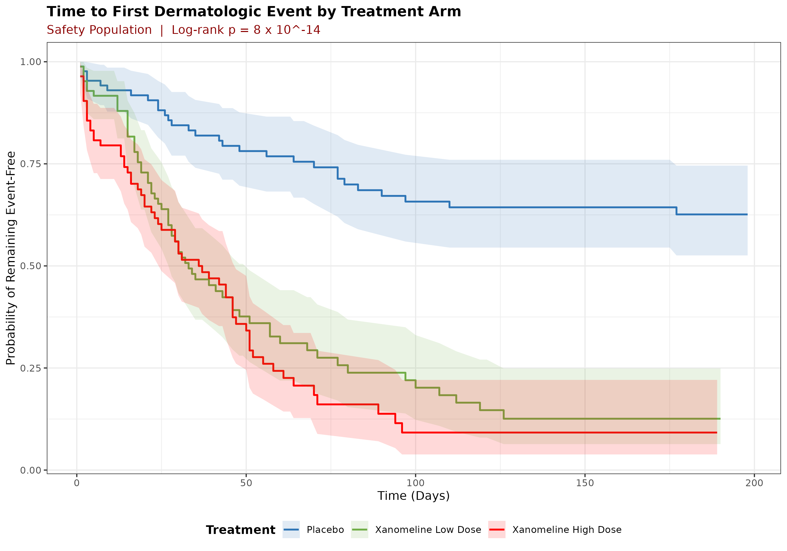
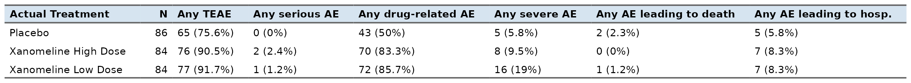
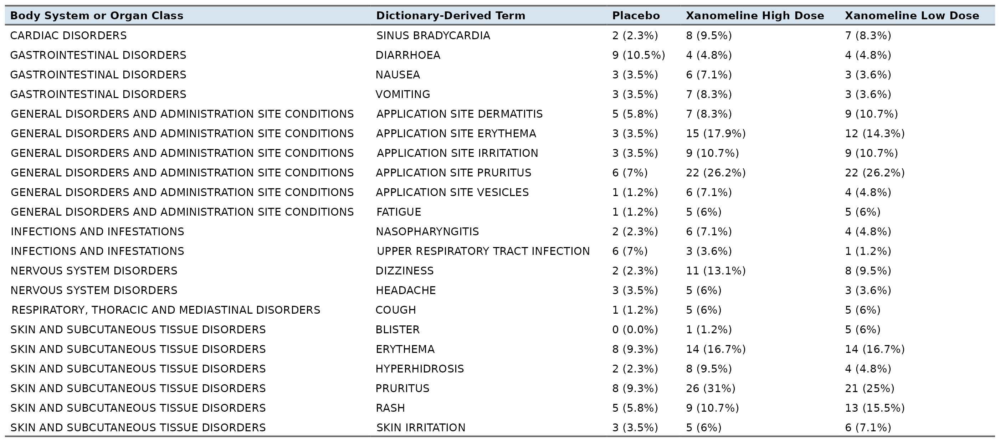

# CDISC Clinical Trial Data Analysis (R)

This project explores CDISC clinical trial datasets (SDTM/ADaM) using R, focusing on data cleaning, transformation, and exploratory statistical analysis.

The goal of this project is to simulate real-world clinical data workflows, including preparing datasets for downstream statistical analysis and generating summary insights.

Data: CDISC Pilot Study Dataset (publicly available at https://github.com/cdisc-org/sdtm-adam-pilot-project)

## Key Work

- Cleaned and transformed subject-level and event-level clinical datasets  
- Merged multiple domains to create analysis-ready datasets  
- Handled missing values and inconsistencies in visit-level data  
- Generated summary statistics for baseline characteristics  
- Performed exploratory data analysis on clinical variables  
- Created visualizations to understand distributions and trends  

## Methods Used

- Descriptive statistics  
- Kaplan-Meier survival analysis  
- Mixed Models for Repeated Measures (MMRM)  

## Outputs

Generated summary tables and visualizations revealing treatment group differences in longitudinal outcomes; MMRM results demonstrated statistically significant improvement in the primary endpoint over 24 weeks.

## Tools Used

- R (tidyverse, dplyr, ggplot2, survival, mmrm)

## Results

### Figure 1 — Kaplan-Meier: Time to First Dermatologic Event

### Table 1 — Baseline Demographics (ITT Population)

### Table 2 — MMRM Results (ADAS-Cog Primary Efficacy)

### Table 3 — Overall AE Summary

### Table 4 — AEs by Body System (≥5% in any arm)

